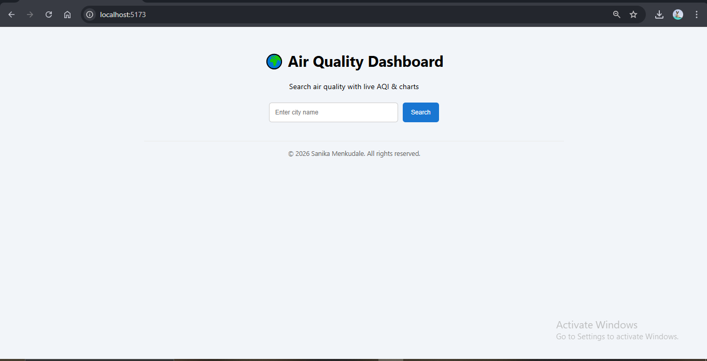

# 🌍 AQI Search Engine (Java + React)

A full-stack **Air Quality Index (AQI) Search Engine** that allows users to search air quality by city name and view detailed air pollution data using an interactive dashboard.

This project is built as part of a coding assignment and follows proper **REST API design**, **caching**, and a **modern frontend UI**.

---

## 🚀 Features

### ✅ Backend (Java – Spring Boot)
- REST API to fetch AQI data by city
- Uses **WAQI (World Air Quality Index) API**
- Implements **in-memory caching** for faster repeated requests
- Handles error cases (invalid city, API failure)
- CORS enabled for frontend integration
- Runs locally as a Spring Boot application

### ✅ Frontend (React – Vite)
- Modern **dashboard-style UI**
- City-based AQI search
- Displays:
  - City name
  - AQI value
  - AQI status (Good / Moderate / Poor / Very Poor)
  - Pollutant data (PM2.5, PM10, NO2, SO2, CO, O3)
- Graceful error handling
- Clean and responsive design

---

## 🛠️ Tech Stack

### Backend
- Java 17
- Spring Boot
- Spring Web
- Spring Cache
- Maven

### Frontend
- React 18
- Vite
- JavaScript (ES6)
- CSS

---

## 🌐 API Used

**World Air Quality Index (WAQI) API**
- Website: https://aqicn.org/api/
- Endpoint used internally by backend

---

## ⚙️ Prerequisites

Make sure the following are installed on your system:
- **Java 17 (JDK 17)**
- **Maven 3.9+**
- **Node.js 18+**
- **npm**
- **VS Code (recommended)**

---

## 📁 Project Structure
```
aqi-search-engine/
│
├── backend-aqi/
│   ├── src/
│   │   ├── main/
│   │   └── test/
│   ├── pom.xml
│   └── application.properties
│
├── frontend-aqi/
│   ├── src/
│   │   ├── components/
│   │   ├── App.jsx
│   │   └── main.jsx
│   ├── index.html
│   └── package.json
│
├── Screenshot/
│   ├── dashboard.png
│   ├── search-results.png
│   └── aqi-details.png
│
└── README.md
```

---

## ▶️ Run Project Locally

### 1️⃣ Start Backend (Spring Boot)
```bash
cd backend-aqi
mvn clean
mvn spring-boot:run
```

**Backend will start at:** `http://localhost:8080`


---

### 2️⃣ Start Frontend (React)
```bash
cd frontend-aqi
npm install
npm run dev
```

**Frontend will start at:** `http://localhost:5173`


---

## 🔗 API Endpoint

**HTTP GET** `/api/air-quality?city=CityName`

**Example:**
```
http://localhost:8080/api/air-quality?city=Pune
```

---

## 📊 Application Screenshots

### Dashboard View


### Search Results


### AQI Details


---

## 📝 Features

- Search AQI by city name
- Dashboard-style UI
- Displays AQI value and pollutants
- Backend caching for faster responses
- Error handling for invalid cities

---

## 👨‍💻 Author

**Sanika Menkudale**
